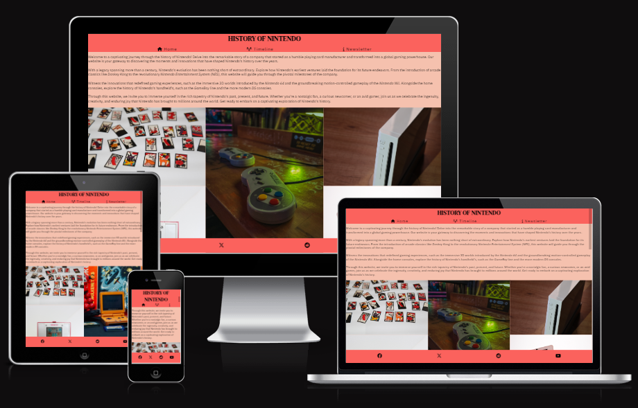
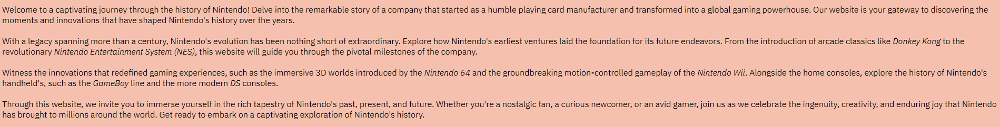
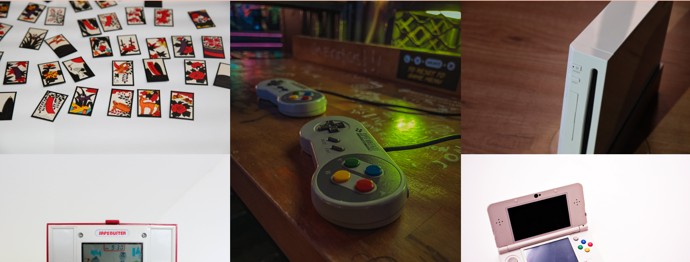
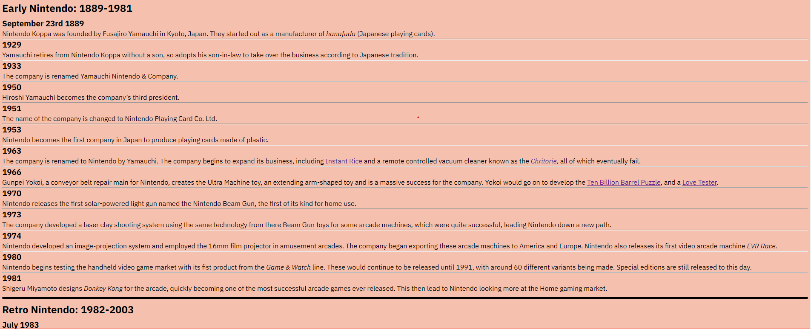
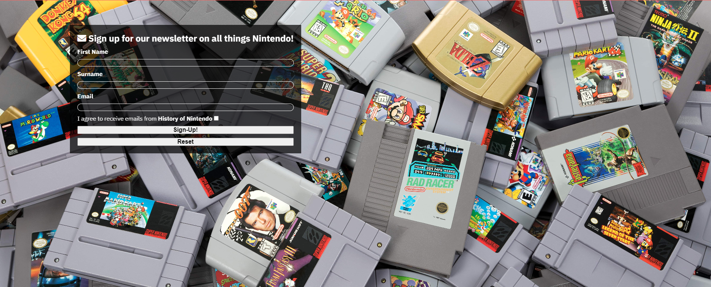

# History of Nintendo

History of Nintendo has been designed for researchers and those interested in seeing a succint breakdown of the history of the video game company Nintendo. It will be useful as it strikes a balance between being easily accessable, and having all the key dates related to the history of the company. Most websites either contain a lot of information making it difficult to find key dates related to the company, or can be vague, missing out events or glossing over key moments. This website strives to meet a middle ground between these two elements.

[Live link](https://jftjenkins.github.io/Portfolio-1/index.html)

## Features

### Existing Features

- __Navigation Bar__

  - The Navigation Bar is visible across all three pages and features links to the Logo, Home Page, Timeline, and the Newsletter signup page. It is identical on each page to assist navigation.
  - This allows users to easily traverse the website without having to use outside sources
  - It also includes hower-over text to help with accessability and bold icons to make the meaning clear as to what each page provides
  - On smaller devices (less than 420px), the titles of each page dissapear leaving only the icons. This is to make sure that the header does not become too cramped and is still useable on smaller screens.

- __Introduction__

  - The introduction text provides the user with information about what the page is about and who it is for.
  - It acts as a hook to bring users in who may be interested in the information provided within the page.

- __Gallery__

  - The Gallery is on the Home Page as it features all the key moments and consoles within Nintendo's history.
  - This allows users to visably see the history of Nintendo through images
  - On smaller screens (less than 576px), the images are actually in chronological order related to the timeline on the other page. However, on larger screens, the images appear in columns so that these images do not take up the entire width of the page and waste space.

- __Footer__

  - The footer includes icons that link to different social media websites, including Facebook, Twitter/X, Reddit and YouTube.
  - It also features hover-over text for accessablity and opens the pages in new tabs to stream line user experience and make sure they do not have to constantly click on the back button to reutrn to the original page.
  - I specifically chose these social media pages as they all provide platforms for users to hold discussions, or find more information, unlike sites like Instagram or Snapchat, which I did not think would be suitable for a page of this style.

- __Timeline__

  - The timeline is split into 3 different periods: "Early Nintendo", "Retro Nintendo", and "'Modern' Nintendo"
  - I chose these periods by splitting up the timeline by Nintendo's pre-games console era (Early Nintendo), when Nintendo first began creating game consoles (Retro Nintendo), and then when they became much more 'mainstream' ('Modern' Nintendo)
  - This will allow users to quickly locate any information they need. For example, if a user is only interested in Nintendo's histroy related to consoles, they can skip all of the "Early Nintendo" section and jump straight to the "Retro Nintendo" section.
  - The dates in the "Early Nintendo" section are usually simply years as they discuss more general events in the company's history. However, once "Retro Nintendo" is reached, exact dates are used when possible as so much happens so quickly during this era. This will make the timeline more accessable to users as they will hopefully not be overwhelmed by the information and will be able to locate what they need.
  - The timeline also features a few hyperlinks to more information about some of the more obscure moments in Nintendo's early history so users can find more information if they are not sure what is being discussed.

- __Newsletter__

  - This page allows users to signup for a newsletter related to the History of Nintendo so they can stay updated about anything that is happening. Users have to fill in their name and email. They also have to check a box agreeing to receive emails from History of Nintendo.

- __Features Left to Implement__

  - In the Gallery, on larger screens when the images are put in columns, they are no longer in chronological order like on the smaller screen. A feature that could be implemented is finding someway to layout the images so that even on larger screens they are in some type on chronological order.
  - The Gallery and the Timeline could be merged together so that the images go along with events related to them

## Testing

I have tested my website by using the Responsive mode on inspection and testing the website at different resolutions. I also used https://ui.dev/amiresponsive to allow me to see what the website would look like on multiple different devices/screen types at once.
I used the [Adobe Color Accessability Tool](https://color.adobe.com/create/color-contrast-analyzer) to make sure my text was always at a suitable contract ratio.

I used the Lighthouse feature on Google Chrome to test the page for both Desktop and Mobile. The only issue that came up was with the performance on the Home Page. I initially thought this was due to the size of the images on the page, so compressed them all. However, the performance was still low. 
I now believe it is due to the column count as, when tested on mobile where there is only 1 column, the performance works fine. To potentially fix this in the future, I could put more details about the images and there placement when put into columns so the website is not trying to sort them out everytime the page is booted up.

I have made my website responsive in a few different ways. Firstly, the text in the Navigation Bar becomes hidden on smaller screens so that the Header does not become too cluttered. In the Gallery on the home page, the images go from 1 column on smaller screens, to 2 columns on medium sized screens, to using 3 columns on larger screens. This is so the images do not take unneccesary space.

### Validator Testing

- HTML
  - No errors were given when used on official [W3C HTML Validator](https://validator.w3.org/nu/?doc=https%3A%2F%2Fjftjenkins.github.io%2FPortfolio-1%2F)
  - No errors were given when used on official [W3C CSS Validator](https://jigsaw.w3.org/css-validator/validator?uri=https%3A%2F%2Fjftjenkins.github.io%2FPortfolio-1%2F&profile=css3svg&usermedium=all&warning=1&vextwarning=&lang=en)

### Unfixed Bugs

There is currently an issue with the gallery when it has 2 or more columns in that there is a gap at the bottom of the page and the images are not flush with the footer. There is currently no way to fix this without going through each image individually and assigning them a specific height/width, which could lead to some images distorting or stretching.

## Deployment

The site was deployed to GitHub pages. The steps to deploy are as follows: 
  - In the GitHub repository, navigate to the Settings tab 
  - From the source section drop-down menu, select the Master Branch
  - Once the master branch has been selected, the page will be automatically refreshed with a detailed ribbon display to indicate the successful deployment. 

The live link can be found here - https://jftjenkins.github.io/Portfolio-1/index.html

## Credits

### Content

- For my research relating to the Timeline, I used the [Official Nintendo History](https://www.nintendo.co.uk/Hardware/Nintendo-History/Nintendo-History-625945.html) and the Wikipedia page on the [History of Nintendo](https://en.wikipedia.org/wiki/History_of_Nintendo)
- I built on some of the code from the [LoveRunning project](https://github.com/jftjenkins/love-running.git) for the Newsletter page
- The icons used in the Nav Bar, Footer, and the Newsletter Signup Form were taken from [Font Awesome](https://fontawesome.com/)

### Media

- The photos on the homepage and newsletter page were taken from these open source sites:
  - https://unsplash.com/
  - https://www.pexels.com/
  - https://pixabay.com/
  - https://www.shutterstock.com/